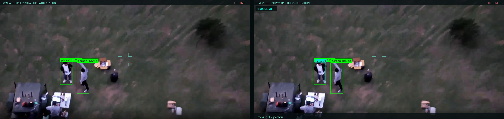
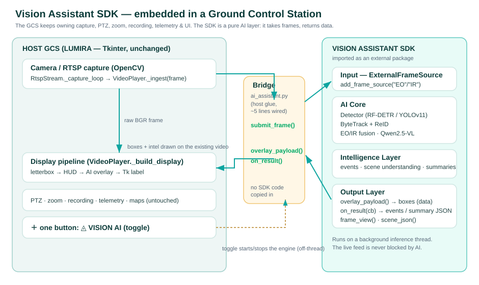

# Integrating the Vision Assistant SDK into an existing GCS

This guide shows how the Vision Assistant SDK embeds into an **existing** surveillance
application — a Ground Control Station (GCS), Video Management System (VMS), or any
app that already owns its cameras — as a pure, drop‑in **AI layer**.

The reference host is **LUMIRA**, a production Tkinter EO/IR operator station. The
integration adds **one button** and changes **nothing** else in its UI. The same
pattern works for any framework (PyQt/PySide, Qt C++, a web client, OpenCV windows).



*Left: LUMIRA as‑is. Right: the same feed with **◬ VISION AI** on — SDK detections,
track IDs and a rolling intel line composited onto the existing video. (Sample
EO frame; the green boxes are baked into the test image, the teal box + badge +
intel strip are live SDK output.)*

---

## 1. The contract

```
HOST (GCS) owns:        camera / RTSP · PTZ · zoom · recording · telemetry · maps · UI
SDK owns:               detection · tracking · EO/IR fusion · vision‑language reasoning
The boundary:           the host PUSHES frames in; the SDK returns RESULTS as DATA.
```

The host never learns how the detector, tracker, fusion engine, or VLM work. The SDK
never opens a camera, draws on the host's widgets, or blocks the live feed (AI runs on
its own inference thread; overlays may lag a frame, the video never does).



---

## 2. The whole integration is four SDK calls

| Step | SDK call | Where it runs in the host |
|------|----------|---------------------------|
| **Init** | `va = VisionAssistant(get_config())` → `va.add_frame_source("EO")` → `va.on_result(cb)` → `va.start()` | once, off the UI thread (model load is slow) |
| **Feed** | `va.submit_frame("EO", frame)` | your capture/decode callback, per frame |
| **Draw** | `payload = va.overlay_payload()` → draw boxes | your display/paint path, per displayed frame |
| **Intel** | `on_result(cb)` → `cb(r)` with `r["summary"]`, `r["events"]`, `r["fusion"]` | callback (engine thread) — stash, render later |
| **Stop** | `va.stop()` | on toggle‑off / shutdown, off the UI thread |

That is the entire surface. Minimal generic host:

```python
from src.config.settings import get_config
from src.engine import VisionAssistant

va = VisionAssistant(get_config())
va.add_frame_source("EO")            # a *push* source — you own capture
va.on_result(lambda r: store(r["summary"], r.get("events", [])))
va.start()

# …on every decoded BGR frame (capture thread):
va.submit_frame("EO", frame)

# …on every displayed frame (render path):
for d in va.overlay_payload().get("eo", {}).get("dets", []):
    draw_box(d["b"], f'{d["c"]}#{d["id"]}')   # d["b"] = [x1,y1,x2,y2] in source px

va.stop()
```

Dual‑sensor? Call `add_frame_source("IR")` too and `va.set_fusion(True)` — fusion
contacts arrive in `overlay_payload()["fusion"]` and `on_result` payloads.

### Mapping boxes onto your displayed video
`overlay_payload()` returns detections in **source‑frame pixels** plus the frame
`w`/`h`. Scale them into wherever you actually draw the video (letterboxed widget,
zoomed view, etc.):

```python
sx = draw_w / payload["eo"]["w"]
sy = draw_h / payload["eo"]["h"]
x1, y1 = off_x + b[0]*sx, off_y + b[1]*sy
```

---

## 3. How LUMIRA was integrated (the reference)

LUMIRA is **Tkinter**; its frame pipeline is `RtspStream → VideoPlayer._ingest(frame)`
(capture thread) → `_build_display()` (letterbox + HUD → PIL) → Tk label. The
integration is **one new file plus a handful of wired lines** — no layout change.

**1. One host‑side bridge module** — [`lumira/ai_assistant.py`](../../../Claude/lumira/ai_assistant.py)
(`VisionAssistantBridge`). This is *host glue*, not SDK code: it imports the SDK as an
external dependency and drives the four calls above. It loads/starts the engine on a
worker thread (UI never stalls), guards every SDK call (an SDK failure shows a toast and
reverts the button — it can never crash the GCS), and draws boxes + an intel strip with
the host's own toolkit (PIL).

**2. One button** — a `VISION AI` pill added to the existing workflow bar
(`app.py::_build_workflow_bar`), toggled by `_wf_toggle_ai()`.

**3. Two one‑line hooks** in the existing frame pipeline (`video/player.py`):

```python
# _ingest(), capture thread — push the frame the host already decoded:
self.app.ai_submit(frame, self.stream_type)

# _build_display(), after the HUD — draw the AI result on top:
img = self.app.ai_annotate(img, self.stream_type, geom, self.native_w, self.native_h)
```

Both call thin no‑ops on the app that delegate to the bridge, so when the AI is off the
pipeline is byte‑for‑byte what it was before. **Total host footprint:** 1 new file,
~6 wired lines, 1 button. PTZ, zoom, recording, telemetry and the entire UI are
untouched.

---

## 4. What the SDK gained for this (improvements made *inside* the SDK)

Integration surfaced two real gaps; both were fixed in the SDK, not worked around in the host:

1. **A push‑frame input.** The engine could only *pull* from RTSP/video/webcam sources it
   opened itself — useless when the host already has the frames. Added
   [`src/ingestion/external_source.py`](../../src/ingestion/external_source.py)
   (`ExternalFrameSource`) and two public engine methods,
   `VisionAssistant.add_frame_source(role)` and `submit_frame(role, image)`. A push
   stream is indistinguishable to the inference loop from a pulled one, and it inherits
   the same real‑time back‑pressure (newest frame wins).

2. **Packaging for external consumption.** Added [`pyproject.toml`](../../pyproject.toml)
   so a host can `pip install -e .` the SDK and import it like any dependency — no source
   copied into the host project.

---

## 5. Run the reference example

A self‑contained, ~150‑line Tkinter "mini‑GCS" that mirrors this exact pattern lives in
[`examples/tkinter_gcs/`](../../examples/tkinter_gcs/). It owns its own OpenCV camera and
embeds the SDK behind one button — every SDK‑specific line is fenced with `# ── SDK ──`.

```bash
# from the SDK repo root, in the SDK's venv
python examples/tkinter_gcs/mini_gcs.py            # webcam (source 0)
python examples/tkinter_gcs/mini_gcs.py rtsp://cam/eo
python examples/tkinter_gcs/mini_gcs.py clip.mp4   # a video file, looped
```

---

## 6. Tuning for your GPU

The embedded engine reads the SDK's `config/config.yaml`. For an 8 GB box, or to run
alongside a host that already uses the GPU, override via env vars (read by the bridge and
the example):

| Env var | Default | Effect |
|---------|---------|--------|
| `VISION_ASSISTANT_SDK` | sibling repo path | where to import the SDK from |
| `VISION_ASSISTANT_BACKEND` | `yolo11` | detector backend (`yolo11` ships with the SDK; `rf_detr` needs the optional wheel) |
| `VISION_ASSISTANT_VLM` | on | set `0` to skip the Qwen VLM for a lighter, faster demo |

YOLOv11 + Qwen2.5‑VL‑3B (4‑bit) is sized to fit 8 GB; drop the VLM if you need the
headroom for the host's own models.
